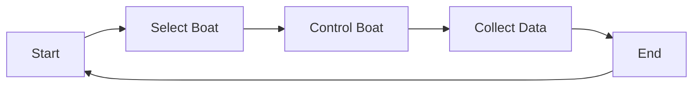

# aqua-sim-xai:

aqua-sim-xai is an Aquatic Simulator for Explainable AI (XAI) applications in aquatic environments. 

This project is developed from: [UnityUWSIM by ahmedharbii](https://github.com/ahmedharbii/UnityUWSIM)

## Overview:
aqua-sim-xai is a simulation project designed for simulating lake Maschsee in Hannover, Germany. This project is for research purposes under HAI-X project at DFKI - MAP.
The simulator is used for generating textual explanations for boat skippers in aquatic environments.

## Features
- **Otter USV Simulation**: Simulates the WAM USV enabling realistic control and behavior testing.
- **Dynamic Weather Control**: Allows for weather condition adjustments, including day/night cycles and fog.
- **Autonomous NPC Boats**: Includes non-player boats with and without collision avoidance for testing interaction scenarios.
- **Explainable UI (XUI)**: Provides tools for collecting and annotating user actions with explanations.
- **Manual/Autonomous Control Modes**: Switch between manual and autonomous control of the simulated boats.
- **Free Camera Movement**: Offers camera movement in display 3 (within the Unity editor only).

## Tested on:
- Ubuntu 22.04 (recommended)
- Unity 2023.3.0a3 (Alpha Version) using HDRP


## Installation:
To set up the project, follow these steps:

1. Clone the repository:
```bash
git clone <repo-url>
```
2. Open the project in Unity 2023.3.0a3 (Alpha Version) using HDRP
3. In Unity, navigate to `Window` -> `Package Manager`.
4. Install the necessary packages (e.g., HDRP) by searching for them in the Package Manager and clicking "Install".


## Prerequisites:

Perception package is needed to be installed to get the ground truth data from the simulation (RGB + Semantic Segmentation + Instance Segementation).
1. [Perception Package](https://github.com/Unity-Technologies/com.unity.perception)
2. Check the requirements for HDRP (High Definition Rendering Pipeline) 

## Getting Started

After setting up the project:
1. Start the simulation within Unity.
2. Experiment with different controls (manual and autonomous) for the boats.
3. Use the Explainable UI (XUI) to document and analyze the behavior of the controlled boats.


## Architecture


## Lake Maschsee OpenStreetMap vs Simulation:

Lake Maschsee is modelled from OpenStreetMap data. The simulation is designed to be as close as possible to the real-world environment. The simulation offers a realistic environment for the user to test the boats.


## Explainability User Interface (XUI):

The XUI is designed to collect textual data from the user to describe the action of the controlled boat. The XUI is designed to be user-friendly and easy to use.

There are two options for the user to select from:
1. User can enter in the text field to describe the action and explanation of the controlled boat.
2. User can enter in the text field the action and select the predefined explanation from the dropdown menu.

 The user can select the action from the dropdown menu and then click on the submit button to save the data. The data is saved in a CSV file for further analysis.
 The action + explanation are also published on the ROS 2 topic for further analysis.

N.B.
The predefined actions can be changed within a JSON file at 
```
/Assets/JsonFiles/Explanations.txt
```


## Domain Randomization:
The project offers domain randomization for the following parameters:
1. Day
2. Night
3. Fog


## Workflow Diagram:



## ROS integration:
The project is ready to be integrated with ROS2, the following packages are needed to be setup in your ROS workspace:

1. [ROS TCP Endpoint](https://github.com/Unity-Technologies/ROS-TCP-Endpoint) 
(N.B: Select ROS version from branches)

## Related Publication
This project is based on research described in the paper, "Interactive Simulator Framework for XAI Applications in Aquatic Environments", which has been accepted for publication in  
[International Conference on Artificial Intelligence CAMBRIDGE, ENGLAND 17-19 DECEMBER 2024](http://www.bcs-sgai.org/ai2024/).
The full reference and link will be added once the paper is published.


## Extra:
If you need to add your own URDF model to the simulator, you can use the URDF importer package from Unity
*  [URDF importer](https://github.com/Unity-Technologies/URDF-Importer)


## Acknowledgements:
Thanks to Unity Robotics Hub for their open-source projects and tutorials - [Unity Robotics Hub](https://github.com/Unity-Technologies/Unity-Robotics-Hub).  
Thanks to the open-source community on Unity Assset store for the free assets used in the project.
